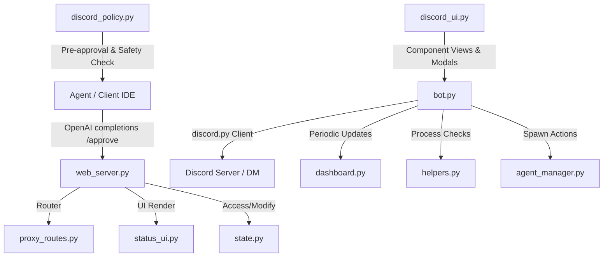

# Discord Liaison Bot Architecture

This document describes the high-level architecture, module responsibilities, classes, and method descriptions for the Discord Liaison Bot daemon.

---

## 📂 System Topology

---

## 📦 Component Responsibilities

### 1. `bot.py`
* **Description**: Coordinates the Discord bot lifecycle, events, background loops (such as transcript monitoring), and command matching/dispatching. Handles messages and text prompt routing.
* **Key Methods**:
  * `create_bot(use_message_content: bool)`: Instantiates the Discord Bot client.
  * `on_ready()`: Triggered when the Discord client logs in.
  * `on_message(message: discord.Message)`: Handles incoming user queries and command invocations.
  * `transcript_monitor()`: Background loop task to scan active agent logs and forward outputs.

### 2. `web_server.py`
* **Description**: FastAPI application runner. Initializes routes, handles pause/resume logic, integrates security rule assessments, and starts the uvicorn daemon.
* **Key Methods**:
  * `start_web_server(port: int)`: Binds and runs uvicorn dynamically.
  * `get_discord_target()`: Resolves a message target (guild channel or direct user DM).
  * `is_dangerous_command(command: str)`: Matches commands against risk policies.

### 3. `schemas.py`
* **Description**: Holds structured Pydantic models for request validation and response definitions between the clients and the daemon.
* **Key Models**:
  * `ApprovalRequest`: Inputs for tool execution review.
  * `ApprovalResponse`: Verdict and justification.
  * `MessageRequest`: Inputs for sending notification updates.
  * `InteractionRequest` / `InteractionResponse`: For conversational queries and user inputs.
  * `SettingsRequest`: Updates daemon provider/permission keys.

### 4. `status_ui.py`
* **Description**: Contains UI templates and handlers for rendering the status endpoint (`/status`) inside the IDE panels/frames.
* **Key Methods**:
  * `get_status_ui(request: Request)`: Generates dynamic status HTML with glassmorphic styling, live logs, and daemon controls.

### 5. `proxy_routes.py`
* **Description**: Implements the OpenAI-compatible API translation proxy router. Handles payload transformations between Claude, Gemini, and Ollama.
* **Key Methods**:
  * `chat_completions(payload: dict, headers: dict)`: Routes and translates prompt completions.
  * `translate_claude_response_to_openai(claude_data: dict, model: str)`: Normalizes Anthropic structures.
  * `resolve_target_and_payload(payload: dict)`: Maps inputs to active model endpoints.

### 6. `dashboard.py`
* **Description**: Handles Discord dashboard embedding, project submenus, updates, and verbose indicator checking.
* **Key Methods**:
  * `build_dashboard_ui()`: Creates the summary embed and interactive buttons.
  * `build_project_menu_ui(project_name: str)`: Constructs the project view.
  * `update_dashboard()`: Edits/pins active status messages.
  * `is_verbose_action_message(content: str)`: Filters noise from agent transcripts.

### 7. `helpers.py`
* **Description**: Multi-purpose file utilities, process scanner, and project/session resolver.
* **Key Methods**:
  * `discover_agent_sessions()`: Scans the app data brain directory.
  * `scan_active_processes()`: Iterates through active shell runs.
  * `extract_and_prepare_files(content: str, seen_paths: set)`: Attaches workspace files to discord updates.

### 8. `state.py`
* **Description**: Defines global configurations and runtime variable maps. Directly references files and environment tokens.

### 9. `discord_policy.py`
* **Description**: Client-side hook intercepting tool and file modifications to enforce local permissions check.

### 10. `discord_ui.py`
* **Description**: Interactive Discord Views, buttons, and text field modals.

### 11. `agent_manager.py`
* **Description**: Spawns python tasks as child processes and sends messaging events.

---

## 🧪 Testing Suites
* `test_suite.py`: Master test runner.
* `test_suite_web.py`: Validates FastAPI routes, validation endpoints, and client payloads.
* `test_suite_bot.py`: Tests dashboard renders, daemon checks, and loop schedulers.
* `test_suite_policy.py`: Asserts command filters and user permissions.
